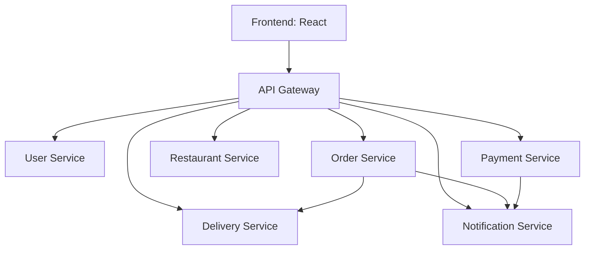

# 🍔 Food Delivery System

**Food Delivery System** is a modern, distributed web application that allows users to order food from multiple restaurants, track orders in real-time, and manage payments. The system is designed using a **microservices architecture** with an **API Gateway** to handle client requests efficiently.

---

## 🚀 Features

- 🛒 **Browse & Order Food**: Users can browse restaurants, view menus, and place orders.  
- 📦 **Order Management**: Track order status from preparation to delivery.  
- 🔐 **Authentication & Authorization**: Secure user login and registration.  
- 💳 **Payment Integration**: Support for multiple payment gateways.  
- 🌐 **Distributed Architecture**: Backend divided into multiple independent services.  
- 🔗 **API Gateway**: Single entry point for client requests, routing to appropriate services.  
- 📡 **Real-time Notifications**: Updates on order status and delivery.  

---

## 🏗️ Architecture Overview

The system is built using a **microservices-based architecture** with the following services:

1. **User Service**  
   - Handles user authentication, registration, and profile management.  

2. **Restaurant Service**  
   - Manages restaurants, menus, and food items.  

3. **Order Service**  
   - Manages order creation, tracking, and history.  

4. **Payment Service**  
   - Handles payment processing and transaction history.  

5. **Delivery Service**  
   - Manages delivery personnel, tracking, and route optimization.  

6. **Notification Service**  
   - In-app notification inbox, email queue, optional Firebase push; event triggers from orders, payments, delivery.  

7. **API Gateway**  
   - Routes client requests to the correct microservice.  
   - Handles authentication, rate-limiting, and load balancing.  

### Mermaid Diagram (for GitHub README)



---

## 📋 CTSE Assignment 1 (2026) – Deliverables

| Requirement | Location |
|-------------|----------|
| CI/CD pipeline | `.github/workflows/ci-cd.yml` |
| DevSecOps — SonarCloud (SAST) | `.github/workflows/sonarcloud.yml`, `sonar-project.properties` |
| DevSecOps — Snyk (optional) | `.github/workflows/snyk.yml` — set `SNYK_TOKEN` |
| OpenAPI / Swagger (all services) | `docs/openapi/` — see `docs/openapi/README.md` |
| Dockerfile | Each service + `api_gateway/` + `food-delivery-frontend/` |
| Cloud deployment (ECS + Azure notes) | `deploy/`, `deploy/aws-ecs/`, `deploy/azure/` |
| Architecture diagram | `docs/ARCHITECTURE.md` (includes Mermaid) |
| Security (IAM, least privilege, DevSecOps) | `docs/SECURITY.md` |
| Integration & group demo script | `docs/INTEGRATION_AND_GROUP_DEMO.md` |
| Official requirement checklist | `docs/CTSE_ASSIGNMENT_COVERAGE.md` |
| Report template | `docs/CTSE_ASSIGNMENT_REPORT_TEMPLATE.md` |
| Docker & CI/CD guide | `docs/DEPLOYMENT_AND_DEVOPS.md` |
| Root env template | `.env.example` |

**SonarCloud**: Add `SONAR_TOKEN` in GitHub repository **Secrets** (from [sonarcloud.io](https://sonarcloud.io)). Set `sonar.organization` in `sonar-project.properties`.

**Public repository**: Make the GitHub repo **public** for the assignment submission.

---

## 🐳 Docker & running the stack

```bash
cp .env.example .env   # optional
docker compose build && docker compose up -d
```

- **Frontend:** http://localhost:3000  
- **API Gateway:** http://localhost:3001  

**Full guide (images, containers, GitHub, CI/CD, production):** [`docs/DEPLOYMENT_AND_DEVOPS.md`](docs/DEPLOYMENT_AND_DEVOPS.md)

### CI/CD summary

| Event | Pipeline behaviour |
|-------|---------------------|
| **Pull request** | Builds & tests Node services, verifies Dockerfiles, builds frontend. |
| **Push to `main`** | Same as above **+ pushes** images to **GHCR** (`ghcr.io/<user>/feedo-*`). |
| **SonarCloud** | Static analysis when `SONAR_TOKEN` is configured. |

See [`.github/workflows/ci-cd.yml`](.github/workflows/ci-cd.yml) for job details.
