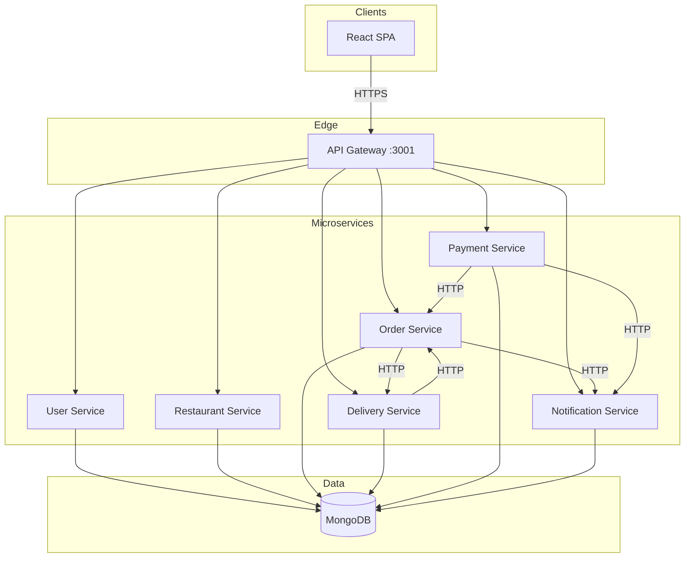

# Feedo — Architecture (CTSE Assignment 1, 2026)

## 1. Assignment alignment

Per **Cloud Computing Assignment** (SE4010): a **cohesive application** split into **independently deployable microservices**, integrated via APIs, with **DevOps**, **security**, and **cloud deployment**. This document supports the **shared architecture diagram** required in the group report.

---

## 2. Mermaid diagram (copy into report / README)



---

## 3. ASCII overview (legacy)

```
                    ┌──────────────┐
                    │   Frontend   │
                    │  (React)     │
                    └──────┬───────┘
                           │ HTTPS
                    ┌──────▼───────┐
                    │ API Gateway  │
                    └──────┬───────┘
         ┌─────────────────┼─────────────────┐
         ▼                 ▼                 ▼
   ┌──────────┐     ┌──────────┐     ┌──────────┐
   │  User    │     │Restaurant│     │  Order   │
   └────┬─────┘     └────┬─────┘     └────┬─────┘
        │                │                │
        │           ┌────▼────┐     ┌─────▼─────┐
        │           │ Menu    │     │ Delivery  │
        │           └─────────┘     └─────┬─────┘
        │                                 │
        └──────────────┬──────────────────┘
                       ▼
              ┌────────────────┐
              │ Payment        │
              │ Notification   │
              └────────┬───────┘
                       ▼
                 ┌──────────┐
                 │ MongoDB  │
                 └──────────┘
```

---

## 4. Inter-service communication (summary)

| From | To | Mechanism |
|------|-----|-----------|
| Order Service | Delivery Service | `POST /api/delivery/deliveries` (create delivery) |
| Order Service | Notification Service | `POST /api/notifications/order-placed`, etc. |
| Payment Service | Order Service | `POST /api/orders/payment/webhook` |
| Payment Service | Notification Service | `POST /api/notifications/payment-result` |
| Delivery Service | Order Service | `PATCH /api/orders/:id/status-update` |
| User Service | Restaurant / Delivery | Registration sync when admin approves |

**Details & demo script:** `docs/INTEGRATION_AND_GROUP_DEMO.md`

---

## 5. Shared infrastructure

- **API Gateway** — routing, JWT validation, CORS
- **MongoDB** — logical databases per service (`user_management`, `restaurant_db`, …)
- **Container registry** — `ghcr.io` (CI/CD)
- **CI/CD** — GitHub Actions (`.github/workflows/ci-cd.yml`)

---

## 6. Security & DevOps pointers

- **Security model:** `docs/SECURITY.md`
- **Deployment:** `docs/DEPLOYMENT_AND_DEVOPS.md`, `deploy/README.md`
- **SAST:** SonarCloud + optional Snyk
